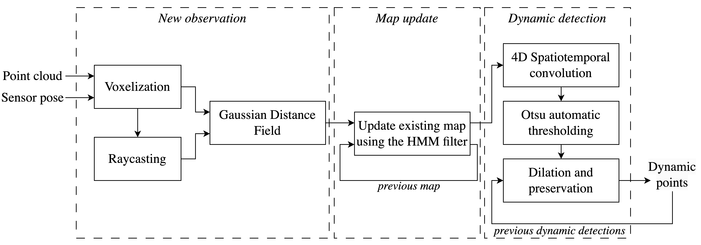
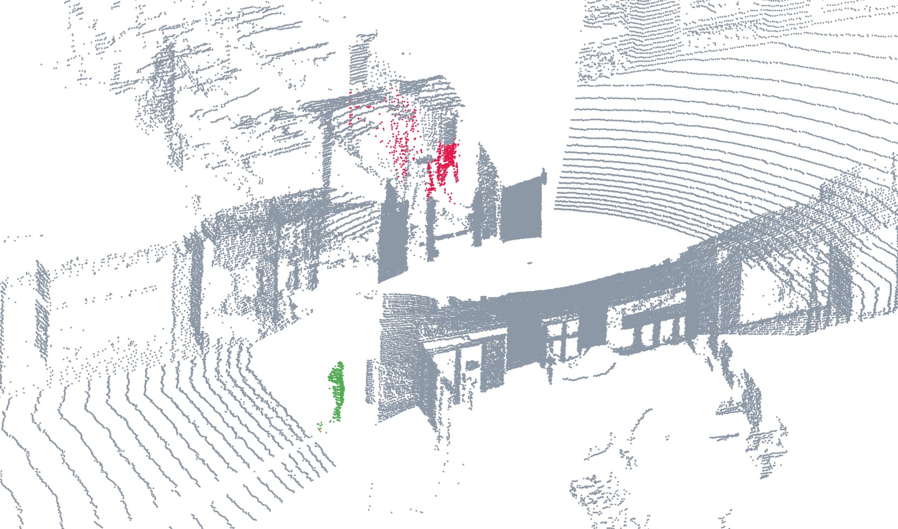
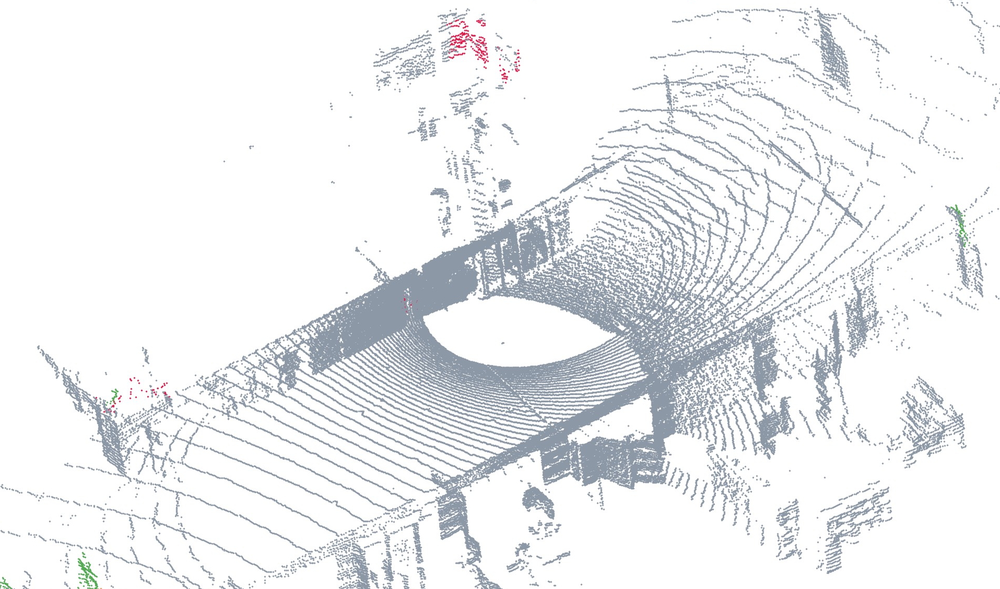

# Moving Object Segmentation in Point Cloud Data using Hidden Markov Models
We propose a novel learning-free approach to segment moving objects in point cloud data.
The foundation of the approach lies in modelling each voxel using a Hidden Markov Model (HMM) and probabilistically integrating beliefs into a global map using an HMM filter.
We extend classic image processing to accurately detect dynamic objects in point cloud data.

The workshop paper ([found here!](https://arxiv.org/abs/2410.18638)) was accepted and presented to the IEEE IROS 2024 workshop on Long-Term Perception for Autonomy in Dynamic Human-shared Environments: What Do Robots Need?

[Click here for a demo!](https://github.com/user-attachments/assets/8ac52292-4b8b-4f97-a4ef-c546965338b5)

This is the open-source implementation of the proposed approach. 
The code is portable, easy to understand and modify.

**Click on each arrow below to reveal the content!**

<details>
<summary><h2>Method</h2></summary>
    
The proposed approach uses a simple three-stage process to label dynamic measurements.
The point cloud is first voxelized, followed by a raycasting operation to determine all the observed voxels.
Information about free and occupied space is described using a Gaussian distance field to generate the likelihood of each voxel being occupied or free.
This information is used by the HMM filter to probabilistically update the occupancy of each voxel.
The local map is queried to detect voxels that have transitioned occupancy.
These changes are filtered using a spatiotemporal convolution to decrease incorrect detections and capture the entire object.



The algorithm configuration parameters are displayed below.
The same configuration set is used for all benchmark testing.

| Parameter        | Units   | Default | Purpose |
|-----------------|--------|---------|---------|
| &epsilon;      | prob   | 0.005   | The configuration parameter to construct the state transition matrix for updating each voxel's state given an observation using the HMM filter. The matrix encodes the transition probabilities within states and is fixed for the MOS task. |
| &Delta;        | m      | 0.2     | Voxel resolution used for discretizing the new scans and the local map. |
| &sigma;    | m      | 0.2     | The lumped uncertainty in estimating a voxel's occupancy given the sensor measurement and corresponding pose. The value is used for generating the measurement conditional densities. We typically set the uncertainty to reflect the uncertainty in the pose estimates. |
| pMin | prob   | 0.99    | Probability threshold for a voxel transitioning to a state. |
| m            | voxels | 5       | Convolution kernel size (m x m x m). |
| &gamma;Min | voxels | 3       | A lower bound on the automatic Otsu threshold. The value corresponds to the minimum number of dynamic voxels in the kernel over the 4D convolution. |
| wL        | scans  | 5       | Length of the local receding window for the 4D convolution computation. |
| wG        | scans  | 300     | Length of the global receding window used to reset voxels. This is useful for handling erroneous observations and pose drift. |
| rMax | m      | -       | The maximum sensor range used for truncating new observations and maintaining the local map size. This is also the maximum MOS range. |

</details>
<details>
<summary><h2>Benchmark Datasets</h2></summary>
    
We test our algorithm using the following open-source datasets. Click the links below to see the download instructions.

* [HeLiMOS](https://sites.google.com/view/helimos)
    The HeLiMOS dataset is based on the KAIST05 sequence of the [HeliPR dataset](https://sites.google.com/view/heliprdataset) recorded by four different LiDARs.
    We estimate the LiDAR pose using [SiMpLE](https://github.com/vb44/SiMpLE), with the estimated poses provided under the *datasetPoses* folder in this repository.
    The performance of the proposed algorithm is shown in the video below, followed by the benchmark results.
    
    [HeLiMOS Demo](https://www.youtube.com/embed/FH-9UKxZl8s)
    
    The benchmarking results are shown below.

    | **Method**                    | **L (%)**  | **A (%)**  | **O (%)**  | **V (%)**  |
    |--------------------------------|----------:|----------:|----------:|----------:|
    | 4DMOS, online                  | 52.1      | 54.0      | 64.2      | 4.7       |
    | MapMOS, scan                   | **58.9**  | 63.2      | **81.4**  | 4.3       |
    | This paper, Δ=0.20 m           | 45.2      | 63.9      | 69.2      | 35.9      |
    | This paper, Δ=0.25 m           | 51.9      | **69.0**  | 74.2      | **36.0**  |
    | **Delayed Results**            |           |           |           |           |
    | 4DMOS, delayed                 | 59.0      | 58.3      | 70.4      | 5.4       |
    | MapMOS, volume                 | **62.7**  | 66.6      | **82.9**  | 5.8       |

    The ground truth labels are downloaded from HeLiMOS.

* [Sipailou Campus](https://github.com/xieKKKi/MotionBEV)
    The Sipailou Campus dataset consists of eight sequences using a Livox Avia mounted to an unmanned ground vehicle traversing the Southeast University Sipailou Campus.
    The sequences are available in the same format as Semantic-KITTI using *.bin* files and corresponding ground truth in *.label* files.
    The provided sensor pose estimates are used.

    [Sipailou Demo](https://www.youtube.com/embed/IOP0yN4GBJo)
    
    The benchmarking results are shown below.

    | **Method**                    | **IoU Validation (%)** | **IoU Test (%)** |
    |--------------------------------|-----------------------:|-----------------:|
    | LMNet                          | 5.4                   | 6.9              |
    | MotionSeg3D                    | 6.8                   | 6.7              |
    | 4DMOS                          | 78.5                  | 82.3             |
    | Motion-BEV                     | 50.4                  | 52.0             |
    | Motion-BEV-h                   | 70.9                  | 71.5             |
    | This paper, Δ=0.25 m           | **84.9**              | 86.0             |
    | This paper, Δ=0.20 m           | 84.8                  | **86.1**         |


* [Apollo Dataset](https://www.ipb.uni-bonn.de/html/projects/apollo_dataset/LiDAR-MOS.zip)
    The Apollo Southbay dataset consists of multiple sequences recorded from a vehicle in an urban environment.
    We estimate the LiDAR pose using [SiMpLE](https://github.com/vb44/SiMpLE), with the estimated poses provided under the *datasetPoses* folder in this repository.
    The performance of the proposed algorithm is shown in the video below, followed by the benchmark results.

    [Apollo Demo](https://www.youtube.com/embed/M2Wn8RvJ9CY)

    The benchmarking results are shown below.

    | **Method**                        | **IoU Validation (%)** |
    |------------------------------------|-----------------------:|
    | LMNet                              | 13.7                  |
    | MotionSeg3D, v1                    | 6.5                   |
    | MotionSeg3D, v2                    | 8.8                   |
    | 4DMOS, online                      | 68.7                  |
    | MapMOS, scan                       | **79.2**              |
    | This paper, Δ=0.20 m               | 76.2                  |
    | This paper, Δ=0.25 m               | 75.8                  |
    | **Delayed Results**                |                       |
    | 4DMOS, delayed                     | 70.9                  |
    | MapMOS, volumetric                 | **81.7**              |

    The *semantic-kitti-api* tools are used to evaluate the results similar to the instructions for the HeLiMOS dataset.

* [Urban Dynamic Objects LiDAR Dataset (DOALS)](https://projects.asl.ethz.ch/datasets/doku.php?id=doals)
    Download instructions are also available on the [open-source Dynablox page](https://github.com/ethz-asl/dynablox?tab=readme-ov-file#Datasets).
    
    The DOALS dataset consists of eight sequences recorded at four distinct locations (two sequences per location).
    The sequences consist of a handheld Ouster OS1-64 LiDAR in human-centric environments.

    The dataset can be downloaded from [here](https://projects.asl.ethz.ch/datasets/doku.php?id=doals), available as ROS1 bags.
    For use with HMM-MOS, the point cloud data is converted to the KITTI *.bin* files.
    The deskewed point clouds are used to compensate for the handheld motion. 
    We estimate the LiDAR pose using [SiMpLE](https://github.com/vb44/SiMpLE).
    Comparison is made to other methods also using the deskewed point clouds.

    Each sequence is accompanied by a *indices.csv* file that contains the indices of the dynamic elements for ten point clouds.
    Any pedestrian-appearing point is labelled as dynamic, with no discrimination whether they are moving or not.
    An evaluation tool is provided in *benchmarking/evaluation*.

    [DOALS Demo](https://www.youtube.com/embed/v-oYnE3rvcg)

    The benchmarking results are shown below.

    | **Method**                          | **ST (%)** | **SV (%)** | **HG (%)** | **ND (%)** |
    |--------------------------------------|----------:|----------:|----------:|----------:|
    | DOALS-3DMiniNet                      | 84.0      | 82.0      | 82.0      | 80.0      |
    | 4DMOS                                | 38.8      | 50.6      | 71.1      | 40.2      |
    | LMNet (original)                     | 6.0       | 7.5       | 4.6       | 3.0       |
    | LMNet (refit)                        | 19.9      | 18.9      | 27.4      | 40.1      |
    | Dynablox                             | **86.2**  | **83.2**  | 84.1      | **81.6**  |
    | This paper, Δ=0.20 m                 | 81.9      | 81.6      | **85.6**  | 80.9      |
    | This paper, Δ=0.25 m                 | 81.7      | 81.1      | 82.2      | 81.1      |
    | **20 m MOS Detection Range**         |           |           |           |           |
    | LC Free Space (20 m)                 | 48.7      | 31.9      | 24.7      | 17.7      |
    | ST Normals (20 m)                    | 80.0      | 81.0      | 85.0      | 76.0      |
    | Dynablox (20 m)                      | 87.3      | **87.8**  | 86.0      | **83.1**  |
    | This paper, Δ=0.20 m (20 m)          | **88.7**  | 84.0      | **87.3**  | 82.9      |
    | This paper, Δ=0.25 m (20 m)          | 86.9      | 84.1      | 83.6      | 82.4      |

* [MOE Dataset](https://github.com/DeepDuke/MOE-Dataset)
    The Moving Event dataset (MOE) provides a series of simulated and real-life sequences consisting of various diverse dynamic objects aimed at improving moving event detection using LiDAR sensors.
    Sequence 00 is a mobile robot exploring an indoor apartment with humans as dynamic objects in the Webots simulator, sequence 01 is an outdoor city scene traversed by a vehicle in the Carla simulator, and sequence 02 is recorded in a crowded pedestrian setting in the Gazebo simulator.

    The provided pose estimates are used.
    The performance of the proposed algorithm is shown in the video below, followed by the benchmark results.

    [MOE Demo](https://www.youtube.com/embed/rJeFaWwSrrU)


    | **Method**                  | **00**  | **01**  | **02**  |
    |-----------------------------|--------|--------|--------|
    | Removert                    | 29.7   | 2.8    | 42.1   |
    | ERASOR                      | 37.8   | 2.8    | 62.7   |
    | Octomap                     | 32.8   | 3.1    | 65.2   |
    | Dynablox                    | 32.0   | 19.5   | 49.2   |
    | DOD                         | 78.6   | 14.2   | 59.5   |
    | M-detector                  | 30.5   | 17.4   | 4.4    |
    | MotionBEV                   | 0.2    | 5.5    | 6.9    |
    | InsMOS                      | 49.5   | 28.2   | 37.9   |
    | 4DMOS, online               | 71.2   | 26.1   | 66.0   |
    | **This paper, Δ=0.20m**     | **80.0** | 38.2   | **81.9** |
    | **This paper, Δ=0.25m**     | 70.6   | **40.5** | 77.6   |
    | 4DMOS, delayed          | 78.0   | 25.7   | 76.2   |
    | MapMOS, volume          | 27.8   | **50.3** | 78.7   |

* [M-Detector](https://drive.google.com/drive/folders/1ASNfrjZB7n9Q-nB4Pm2IwvArFWnTcFAj)
    M-Detector labels three open-source datasets and releases a self-created dataset.
    * The Avia dataset provides 45 short indoor sequences capturing small flying objects with a static Livox Avia.
    * The NuScenes dataset provides ten short sequences of a vehicle driving in an urban environment. Labels are only provided at 2 Hz. The majority of the dynamic detections are captured on the vehicle itself, skewing the evaluation results. 
    * The KITTI dataset provides 20 short sequences of a vehicle driving in an urban environment. Most dynamic objects are other vehicles.
    * The Waymo dataset provides 44 short sequences of a vehicle driving in an urban environment. Most dynamic objects are other vehicles.

    For the open-source datasets, measurements corresponding to an object with a velocity greater than a threshold are labelled as dynamic, 0.5 m/s for pedestrians and 1.0 m/s for vehicles.

    [M-Detector Demo](https://www.youtube.com/embed/Bp6rYDwyc5A)

    The benchmarking results are shown below.
    Evaluation on the M-detector datasets with best results in bold. Results for other methods are as documented by Wu (2024).

    | Method                              | Avia  | KITTI | NuScenes | Waymo |
    |-------------------------------------|------:|------:|---------:|------:|
    | LMNet-1                             |  0.7  |  55.4 |   11.1   |  4.2  |
    | LMNet-8                             |  0.2  |  63.5 |    3.3   |  2.5  |
    | SMOS                                | 15.1  |  20.5 |    8.2   |  4.3  |
    | M-detector (point-out)              | 62.9  |  57.0 |   85.5   | 64.0  |
    | M-detector (frame-out)              | **91.6**  |  **74.6**  |  **90.2**  |  **74.6**  |
    | This paper, Δ = 0.20 m              | **94.0**  |  64.4 |   86.7   | 68.3  |
    | This paper, Δ = 0.25 m              | 90.2  |  63.7 |   89.1   | 69.9  |

</details>
<details>
<summary><h2>Hardware and Dependencies</h2></summary>
    
This implementation has been tested on Ubuntu 20.04.5/6 LTS (Focal Fossa) with an Intel Core i7-10700K CPU @ 3.80GHz x 16 and 62.5 GiB memory.
HMM-MOS uses a few open-source libraries for reading the algorithm configuration file, Kd-Trees, hash maps, matrix operations, and CPU threading.
The installation instructions are detailed below.

* Git is required to download the open-source libraries.
```bash
sudo apt install git
```
* Install the g++ compiler.
```bash
sudo apt install g++
```
* Require a g++ v10 compiler.
```bash
sudo apt install g++-10
```
Ensure the newer compiler is used.
```bash
g++ --version
```
The expected output is shown below.
```bash
g++ (Ubuntu 10.5.0-1ubuntu1~20.04) 10.5.0
Copyright (C) 2020 Free Software Foundation, Inc.
This is free software; see the source for copying conditions.  There is NO
warranty; not even for MERCHANTABILITY or FITNESS FOR A PARTICULAR PURPOSE.
```
If the incorrect version is displayed, [set the correct compiler](https://askubuntu.com/questions/26498/how-to-choose-the-default-gcc-and-g-version).
```bash
sudo update-alternatives --install /usr/bin/g++ g++ /usr/bin/g++-10 10
```
* CMake is required to compile the libraries and the repository.
```bash
sudo apt install cmake
```
* Install the Eigen library for math operations [1].
```bash
sudo apt install libeigen3-dev
```
* Install Intel's Thread Building Blocks (TBB) library for CPU threading.
```bash
sudo apt install libtbb-dev
```
If the HMM-MOS repository build in the following section returns an error that it cannot find TBB for CMake, the following installation may help.
```bash
git clone https://github.com/oneapi-src/oneTBB.git
cd oneTBB
mkdir build && cd build
cmake ..
sudo make install
```
* Clone and install the *nanoflann* library for KD-tree operations.
```bash
git clone https://github.com/jlblancoc/nanoflann.git
cd nanoflann
mkdir build && cd build
cmake ..
sudo make install
```
* Install the *unordered dense* library for the hashmap implementation.
```bash
git clone https://github.com/martinus/unordered_dense.git
cd unordered_dense
mkdir build && cd build
cmake ..
sudo make install
```
* Install the *yaml-cpp* library for reading the configuration file.
```bash
git clone https://github.com/jbeder/yaml-cpp.git
cd yaml-cpp
mkdir build && cd build
cmake ..
sudo make install
```
* Install the *boost* libraries.
```bash
sudo apt-get install libboost-all-dev
```
* Install the *rapidcsv* library for evaluating the DOALS sequences.
```bash
git clone https://github.com/d99kris/rapidcsv.git
cd rapidcsv
mkdir build && cd build
cmake ..
sudo make install
```

Alternative options for any of the libraries can be used if desired.
The code is easy to change.
</details>
<details>
<summary><h2>HMM-MOS Installation</h2></summary>
    
Clone the repository.
```bash
git clone https://github.com/vb44/HMM-MOS.git
```

Create a build folder in the repository.
```bash
cd HMM-MOS
mkdir build && cd build
```

Run CMake.
```bash
cmake ../
```

Make the executable.
```bash
make
```

The code only works with *.bin* files in the KITTI format.
However, the code is very easy to modify to suit the desired inputs and outputs.
When compiled, the HMM-MOS algorithm is run using a *.yaml* algorithm configuration file as shown below.
```bash
./hmmMOS config.yaml
```
Sample config files are included in the *config* folder.
An example is shown below.
```yaml
---
# File paths
scanPath: /pathToScans  # Must be .bin scan files.
posePath: /pathToPoses  # Must be in the KITTI format.
minRange: 0.5           # [m]
maxRange: 50            # [m]
outputFile: true        # true/false
scanNumsToPrint: [969, 1079] # Leave as [] if not being used. Scans indexed from 1.
outputFileName: /outputFilePathAndName
outputLabels: true      # true/false
outputLabelFolder: /outputLabelFolderPath

# Configuration parameters
voxelSize: 0.25                 # [m]
occupancySigma: 0.25             # lumped uncertainty [m]
beliefThreshold: 0.99           # probability [0-1]
convSize: 5                     # odd integer
localWindowSize: 3              # local window size [#]
globalWindowSize: 300           # global window size [#]
minOtsu: 3                      # min dynamic voxels in spatiotemporal convolution [#]
```   
</details>
<details>
<summary><h2>Sample Results Interpretation</h2></summary>
    
MOS results can be saved in,
* a *single file* with point cloud indices for each scan per row for evaluation with *DOALS* ground truth, or,
* *.label* files from Semantic KITTI for evaluation with *Sipailou Campus* and *Apollo* datasets.

### HeLiMOS Evaluation
The ground truth labels are downloaded from HeLiMOS.
The *semantic-kitti-api* tools are used to evaluate the results.
The steps are outlined below.

1. Copy the relevant label predictions (for which there is a ground truth) from HMM-MOS to a sequences directory. The required file structure is shown below. The numbers correspond to the four LiDARS: 00 (Aeva), 01 (Avia), 02 (Ouster), 03 (Velodyne).
```bash
sequences
├── 00
│   ├── labels
│   ├── predictions
│   └── velodyne
├── 01
│   ├── labels
│   ├── predictions
│   └── velodyne
├── 02
│   ├── labels
│   ├── predictions
│   └── velodyne
└── 03
    ├── labels
    ├── predictions
    └── velodyne
```
2. For example, if we want to evaluate sequence 03 (Velodyne). Edit the *config/semantic-kitti-mos.yaml* file to replace *8* in the valid field to *3*.
```python
split: # sequence numbers
  train:
    - 0
    - 1
    - 2
    - 3
    - 4
    - 5
    - 6
    - 7
    - 9
    - 10
  valid:
    - 3 # was 8 originally
  test:
    - 11
    - 12
    - 13
    - 14
    - 15
    - 16
    - 17
    - 18
    - 19
    - 20
    - 21
```
3. Run the evaluation for sequences 03.
```bash
python3 evaluate_mos.py --dataset /pathToFolder/
```
The expected output is shown below.
```bash
********************************************************************************
INTERFACE:
Data:  /pathToSequencesFolder/
Predictions:  /pathToSequencesFolder/
Backend:  numpy
Split:  valid
Config:  config/semantic-kitti-mos.yaml
Limit:  None
Codalab:  None
********************************************************************************
Opening data config file config/semantic-kitti-mos.yaml
Ignoring xentropy class  0  in IoU evaluation
[IOU EVAL] IGNORE:  [0]
[IOU EVAL] INCLUDE:  [1 2]
labels:  3164
predictions:  3164
Evaluating sequences: 10% 20% 30% 40% 50% 60% 70% 80% 90% ********************************************************************************
below can be copied straight for paper table
iou_moving: 0.360

```

### Sipailou Campus Evaluation
The Sipailou campus dataset is provided by [MotionBEV](https://github.com/xieKKKi/MotionBEV/).
MotionBEV use the Semantic Kitti API to compute the *validation* (seq 06) and *test* (seq 00, 07) IoUs.
To provide a fair evaluation with the results published in the [MotionBEV paper](https://ieeexplore.ieee.org/document/10287575), we use the same evaluation tools.
The evaluation steps are outlined below.

***It is important to ensure the HMM-config has a minimum range of 3m and a maximum range of 50m as the ground truth is only labelled within these ranges.***

1. Clone the [Semantic Kitti API](https://github.com/PRBonn/semantic-kitti-api) repository.
```bash
git clone https://github.com/PRBonn/semantic-kitti-api.git
```
2. Copy the label predictions to the *sipailou-livox-kitti* directory sequence folder. The required file structure is:
```bash
# sipailou-livox-kitti directory tree
# The HMM-MOS labels are copied into the predictions folder.

sipailou-livox-kitti
└── sequences
    ├── 00
    │   ├── calib.txt
    │   ├── labels
    │   ├── poses.txt
    │   ├── predictions
    │   └── velodyne
    ├── 06
    │   ├── calib.txt
    │   ├── labels
    │   ├── poses.txt
    │   ├── predictions
    │   └── velodyne
    └── 07
        ├── calib.txt
        ├── labels
        ├── poses.txt
        ├── predictions
        └── velodyne
```
3. A copy of the *livox-SEU-MOS.yaml* evaluation config from the [MotionBEV repository](https://github.com/xieKKKi/MotionBEV) can be located at *HMM-MOS/config/eval/* for convenience.
4. Run the validation evaluation.
```bash
cd semantic-kitti-api
python3 evaluate_mos.py --dataset /pathToFolder/sipailou-livox-kitti/ --datacfg /pathToHmmMos/config/eval/livox-SEU-MOS.yaml -s valid
```
The expected output is shown below.
```bash
********************************************************************************
INTERFACE:
Data:  /pathToFolder/sipailou-livox-kitti/
Predictions:  /pathToFolder/sipailou-livox-kitti/
Backend:  numpy
Split:  valid
Config:  /pathToHmmMos/config/eval/livox-SEU-MOS.yaml
Limit:  None
Codalab:  None
********************************************************************************
Opening data config file /pathToHmmMos/config/eval/livox-SEU-MOS.yaml
[IOU EVAL] IGNORE:  []
[IOU EVAL] INCLUDE:  [0 1]
labels:  3191
predictions:  3191
Evaluating sequences: 10% 20% 30% 40% 50% 60% 70% 80% 90% ********************************************************************************
below can be copied straight for paper table
iou_moving: 0.849
```
5. Run the test evaluation.
```bash
python3 evaluate_mos.py --dataset /pathToFolder/sipailou-livox-kitti/ --datacfg /pathToHmmMos/config/eval/livox-SEU-MOS.yaml -s test
```
The expected output is shown below.
```bash
********************************************************************************
INTERFACE:
Data:  /pathToFolder/sipailou-livox-kitti/
Predictions:  /pathToFolder/sipailou-livox-kitti/
Backend:  numpy
Split:  test
Config:  /pathToHmmMos/config/eval/livox-SEU-MOS.yaml
Limit:  None
Codalab:  None
********************************************************************************
Opening data config file /pathToHmmMos/config/eval/livox-SEU-MOS.yaml
[IOU EVAL] IGNORE:  []
[IOU EVAL] INCLUDE:  [0 1]
labels:  6201
predictions:  6201
Evaluating sequences: 10% 20% 30% 40% 50% 60% 70% 80% 90% ********************************************************************************
below can be copied straight for paper table
iou_moving: 0.861
```

### DOALS Evaluation
The DOALS dataset provides 10 manually labelled scans per sequence for evaluation in *indicies.csv* files.
An evaluation tool is provided in *benchmarking/evaluation*.

#### Build evaluation tools for DOALS
Go to the *benchmarking/evaluation* folder.
```bash
cd benchmarking/evaluation
```
Make and enter the build directory.
```bash
mkdir build && cd build
```
Run *cmake* and *make*.
```bash
cmake ../src
make
```

#### Evaluate results
Once the evaluation tool is built as explained in the instructions above, use the tool directly or the provided bash script in the *benchmarking/evaluation/scripts* folder.

Using the tool directly.
```bash
cd benchmarking/evaluation/build/
./evalIndFile gtFilePath estFilePath scanFolderPath sequenceNum minRange maxRange
```

Using the provided script.
```bash
cd benchmarking/evaluation/scripts/
./checkDOALS.sh # Edit the script parameters.
```

An example output of the DOALS Hauptgebaeude sequence 1 20m range evaluation is shown below.
```bash
|-------|-----------|-------|
|  IoU  | Precision | Recall|
|-------|-----------|-------|
| 84.34 |   97.11   | 86.52 | 
| 79.07 |   85.94   | 90.83 | 
| 97.00 |   99.34   | 97.63 | 
| 89.88 |   99.35   | 90.41 | 
| 86.40 |   99.43   | 86.83 | 
| 89.10 |   98.77   | 90.10 | 
| 95.49 |   99.33   | 96.11 | 
| 86.59 |   97.94   | 88.19 | 
| 84.22 |   97.44   | 86.12 | 
| 96.14 |   99.72   | 96.41 | 
|-------|-----------|-------|
Mean IOU: 88.82
```
</details>

<details>
<summary><h2>Limitations</h2></summary>
    
The limitations, or scenarios of degraded performance, of the proposed algorithm are discussed here.
These include (I) handling LiDAR returns from reflective surfaces, (II) capturing dynamic objects moving into unobserved space, and (III) handling large pose estimation errors.

**(I) Handling returns from reflective surfaces**

LiDARs have known sensing limitations from reflective surfaces such as windows.
The proposed algorithm is not appearance-based, and any *moving* measurement relative to a fixed frame is labelled as dynamic.
The DOALS dataset has a few occurrences where this occurs.
Two such examples from the Niederdorf and Shopville sequences are shown below.
Such scenarios drastically increase the false positives, decreasing the resulting IoU value.

*Niederdorf scan 1696*


<br>

*Shopville scan 879*


<br>

**(II) Dynamic objects moving into unobserved space**

Objects moving into unobserved space are unable to be captured.
It is for this reason that state-of-the-art algorithms such as 4DMOS and MapMOS provide a delayed result.
This allows information from *n* scans ahead of the current scan to be included before the prediction is made (e.g. *n* = 10).

**(III) Handling large pose estimation errors**

The sensor's pose is used to locate sensor measurements in the map frame.
Large errors in the sensor's pose incorrectly transform points and lead to erroneous dynamic detections.
Pose drift from SLAM solutions is not an issue as a global receding window is used to maintain the local map, with any voxels outside the maximum sensor range and those that have not been observed for the last *wG* scans are removed.
</details>

## References
[1] [eigen library](https://eigen.tuxfamily.org/dox/GettingStarted.html)
